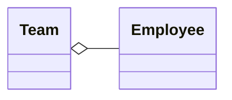

Représente une relation d'inclusion, la destruction de l'objet composite n'entraîne pas la destruction des objets composants

Ex : hôtel et employés -> la destruction de l'hôtel n'entraîne pas celle des employés

