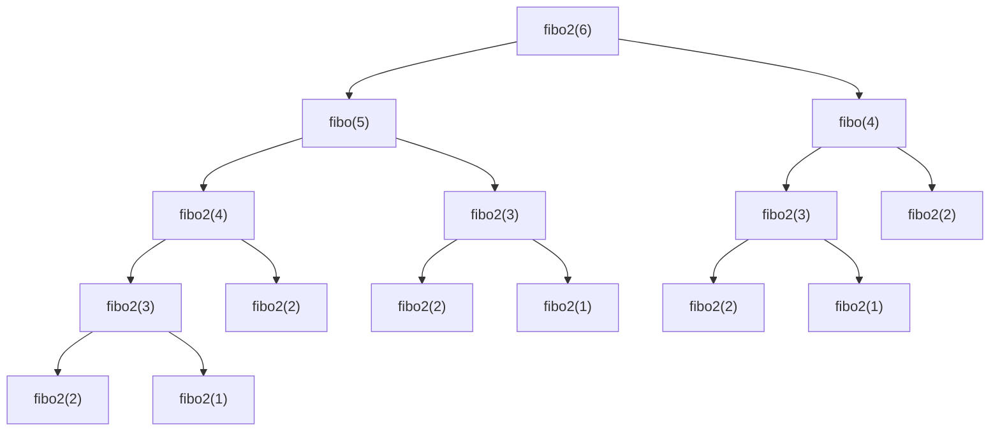
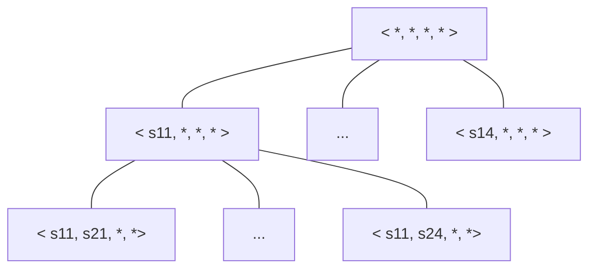

# Introduction
---
## Domaine de l'algorithmique

- **la conception des algorithmes :** n'est pas automatisable (sauf exceptions comme la génération de compilateur). Mais il existe des techniques de conception qui aident à construire de "bons" algorithmes
- **l'expression des algorithmes :** nécessite un support : language de programmation
- **la validation des algorithmes :** prouver que l'algo fournit toujours le résultat voulu
- **l'analyse des algorithmes :** étudier les temps et la mémoire nécessaires à l’exécution
- **la définition de jeux d'essais :** étude expérimentale, on exécute l'algo sur des données d'entrée "représentatives". Objectifs : mettre au point l'algo et mesurer le temps effectif

## Rappel sur la complexité temporelle

**La notation $O$** 
Soit $f:\mathbb{N} \rightarrow \mathbb{R}^*$ une fonction quelconque
On définit la classe : $O(f(n))=\{t:\mathbb{N} \rightarrow \mathbb{R}^*, \exists c \in \mathbb{R}^*_+, \exists n_0 \in \mathbb{N}, \forall n \ge n_0, t(n)\le c.f(n)\}$ 
--> les fonctions $t(n)$ bornées supérieurement par un multiple de $f(n)$ pour $n$ suffisamment grand
--> fournit un majorant de la complexité (mais pas très informatif)

**La notation $\theta$ : ordre exact de $f(n)$**
$\theta(f(n))=\{t:\mathbb{N} \rightarrow \mathbb{R}^+, \exists c,d \in \mathbb{R}^*_+,\exists n_0 \in \mathbb{N}, \forall n \ge n_0, (c.f(n)\le t(n)\le d.f(n))\}$ 

**tractable :** jusqu'à $n^k$ (avec k petit) (temps acceptables)

## Exemples de raffinement d'algorithmes

### **Calcul de $\binom{n}{k}$ :**
- **Méthode 1 (naïve) :** on utilise la définition usuelle, càd : $\binom{n}{k} = \frac{n!}{p!(n-p)!}$ 
	- 3 factorielles à calculer
	- nombre de multiplications/divisions = $(n-1)+(p-1)+(n-p-1)+2=2n-1 \in \theta(n)$ 
- **Méthode 2 :** en calculant $n!$, on a déjà calculé $p!$ et $(n-p)!$ (on fait le calcul en 3 tranches)
	- une seule boucle
	- coût : $(n-1)+2 = n+1$ opérations $\in \theta(n)$ 
- **Méthode 3 :** on simplifie l'expression qui devient (en supposant $p\le n-p$) : $\frac{n-p+1\times ... \times n}{1\times 2\times ... \times p}$ 
	- coût : $(n-(n-p+1))+(p-1)+1=2p-1$, ce nombre est inférieur à $n+1$, en effet $p\le n-p \implies 2p\le n \implies 2p-1\le n-1\le n+1$ 

### **Calcul du $n^{ième}$ terme de la suite de Fibonacci :** 
Rappel : $\begin{cases} fib(1)=fib(2)=1 \\ fib(n)=fib(n-1)+fib(n-2), \ \forall n\gt 2\end{cases}$ 
- **Méthode 1 :** On peut démontrer par récurrence que $fib(n)=\frac{(\frac{1+\sqrt{5}}{2})^n-(\frac{1-\sqrt{5}}{2})^n}{\sqrt{5}}$                           On peut donc utiliser l'algo suivant :
```
fonction fibo1(ent n) : réel;
début
	résultat <-- (((1+sqrt(5))/2)**n-((1-sqrt(5))/2)**n)/sqrt(5)
fin;
```
--> donnera une valeur approchée (un réel) de la valeur exacte (qui est un entier) de façon presque instantanée. Mais la précision de calcul de la racine carrée génère des erreurs d'arrondi pour des valeurs assez grandes de $n$
- **Méthode 2 (naïve) :** calcul par une fonction récursive calquée sur la formule de récurrence (algorithme de type diviser pour régner)
```
fonction fibo2(ent n): ent;
début
	si n=1 ou n=2 alors
		résultat <-- 1
	sinon
		résultat <-- fibo2(n-1)+fibo2(n-2)
	finSi
fin 
```



Remarque : on calcule 3 fois fibo(3)
- la méthode n'est pas optimale
- redondance de traitement

Complexité :
Soit $nbap(k)$ le nombre d'appels récursifs engendrés par fibo2(k)
- exprimés sous forme récurrente $nbap(k)$
- résoudre

$\begin{cases} nbap(k) = 0 \ si \ k = 1 \ ou \  k = 2, \\ 2+nbap(k-1)+nbap(k-2) \ sinon\end{cases}$ 

ce qui se réécrit en posant $NB(i) = nbap(i)+2$
$\begin{cases} NB(k) = 2 \ si \ k=1 \ ou \ k=2 \\ NB(k-2) \ sinon \end{cases}$ 

--> on retombe sur une suite de Fibonacci avec valeurs initiales différentes (2 au lieu de 1)
On note finalement que 

D'où $NB(k) = 2\times \frac{(\frac{1+\sqrt{5}}{2})^n-(\frac{1-\sqrt{5}}{2})^n}{\sqrt{5}}$ 
Donc $nbap(k)=2\times \frac{(\frac{1+\sqrt{5}}{2})^n-(\frac{1-\sqrt{5}}{2})^n}{\sqrt{5}}-2$ 
--> complexité exponentielle !

- **Méthode 3 :** utilisation d'un tableau dans lequel on stocke les valeurs déjà calculées (algorithme de type programmation dynamique)
```
fonction fibo3(ent n): ent;
var ent i;
début
	T[1] <-- 1; T[2] <-- 1;
	pour i allant de 3 à n faire
		T[i] <-- T[i-1]+T[i-2]
	finPour
	résultat <-- T[n]
fin
```
Complexité spatiale $\theta(n)$ et complexité temporelle $\theta(n)$

Remarque : on peut se passer de tableau et utiliser 3 variables
```fonction fibo4(ent n): ent;
var ent i, x, y, z;
début
	x <-- 1, y <-- 1;
	pour i allant de 3 à n faire 
		z <-- x+y;
		x <-- y;
		y <-- z;
	finPour
	résultat <-- z
fin
```
Complexité spatiale $\theta(1)$ et complexité temporelle $\theta(n)$

- **Méthode 4 :** Calcul matriciel récurrent (algorithme de type DpR)                                           Soit $V(i)$ un vecteur colonne à 2 éléments : $V(i) = \begin{bmatrix} u(i)=fib(i) \\ v(i)=fib(i+1)\end{bmatrix}$                                 et F une matrice $2\times 2$  : $F=\begin{bmatrix} a & b \\ c & d\end{bmatrix}$ 
1) Que doivent valoir a, b, c, d pour qu'on ait $V(n) = F\times V(n-1)$ 
	on trouve $F=\begin{bmatrix} -1 & 1 \\ 1 & 0\end{bmatrix}$ 

### **Produit de polynômes**

### **Porduit de matrices carrées d'ordre n ($n=2^k$) - Méthode de Strasses** 

Méthode naïve pour le produit de 2 matrices carrées -> 3 boucles imbriquées variant de 1 à n -> $\theta(n^3)$ (opération élémentaire : addition / multiplication)

Méthode DpR :

$\begin{bmatrix} A_{11} & A_{12} \\ A_{21} & A_{22}\end{bmatrix}\begin{bmatrix} B_{11} & B_{12} \\ B_{21} & B_{22}\end{bmatrix}=\begin{bmatrix} C_{11} & C_{12} \\ C_{21} & C_{22}\end{bmatrix}$ 

$P=(A_{11}+A_{22})(B_{11}+B_{22})$ 
$Q=(A_{21}+A_{22})B_{11}$ 
$R=A_{11}(B_{12}-B_{22})$ 
$S=A_{22}(B_{21}-B_{11})$ 
$T=(A_{11}+A_{22})B_{22}$ 
...

$\begin{cases} T(n)=7T(\frac{n}{2})+18n^2 \\ T(1)=1\end{cases}$ 

**Théorème du maître** -> cas 3, $a=7, b=2, \alpha =2$ -> $\theta(n^{\log_{b}(a)})=\theta(n^{\log_{2}(7)}) \approx \theta(n^{2.81})$ 

[[AA - TD1]]

# Essais successifs (Trials and errors)
---

## Principe

De nombreux problèmes n'ont pas de solution "directe" --> on doit examiner (a priori exhaustivement) l'ensemble des solutions candidates.

3 variantes : 
- recherche de toutes les solutions à un problème
- recherchez d'une solution quelconque 
- recherche de la meilleure solution (critère d'optimalité)

On représentera une solution par un vecteur $<x_1, \ ..., \ x_n>$ (qui dépend de la modélisation du problème). Si $x_i$ prend ses valeurs dans un ensemble $S_i$ fini de cardinalité $n_i$, on aura $\prod\limits_{i=1}^{n}m_i$ solutions candidates.

**Démarche :** 
- construire le vecteur solution courante pas à pas ($x_1$ puis $x_2$ etc...)
- quand on choisit une valeur pour $x_i$, on vérifie que le vecteur partiel $<x_1, \ ..., \ x_n>$ satisfait un **critère d'acceptabilité**. Si ce n'est pas le cas, on arrête le développement de ce début de solution

## Exemple introductif

Placement de $n$ reines sur un échiquier $n\times n$ sans que ces reines ne soient en prise (posé par [Gauss](https://www.wikiwand.com/fr/articles/Carl_Friedrich_Gauss) vers 1850)

![[Pasted image 20250128163841.png]]

Vecteur solution $X =$ un vecteur de couple $(x,y)$ de taille $n$ 
$(x_i, y_i)=$ position de la $i^{ème}$ reine placée

**Critère d'acceptabilité p :** 
- $p_1 : \nexists \ \mbox{2 reines sur la même ligne}$
- $p_2 : \nexists \ \mbox{2 reines sur la même colonne}$
- $p_3 : \nexists \ \mbox{2 reines sur la même diagonale}$

Nombre de solution candidates :
-> nombre de façons de choisir $n$ cases parmi $n^2$ 
-> $\binom{n^2}{n} = \frac{n^2!}{n!(n^2-n)!} \ \mbox{pour n = 4 :} \ \frac{16!}{4!12!}=1820 \ \mbox{solutions}$ 

**Mais** on a vu qu'il ne peut y avoir 2 reines sur la même ligne
-> On peut imposer une certaine forme aux doublets $(x,y)$ 
$$X=<(1,\ y_1),\ (2,\ y_2), \ ..., \ (n,\ y_n)>$$
-> $n^n \ \mbox{solutions. Pour n = 4 : 256 solutions candidatese}$ 
```
procédure solCandidates1;
var ent y1, ent y2, ent y3, ent y4;
début
	S <- vide;
	pour y1 de 1 à 4 faire:
		pour y2 de 1 à 4 faire:
			pour y3 de 1 à 4 faire:
				pour y4 de 1 à 4 faire:
					 S <- S U {<(1, y1), (2, y2), (3, y3), (4, y4)>}
				finPour;
			finPour;
		finPour;
	finPour;
	// ne garder dans S que les solutions satfaisant p2 et p3
fin;
```

**Remarque :** comme 2 reines ne peuvent pas être sur la même colonne $<y_1, \ ..., \ y_n>$ doit être une permutation de $\{1, \ ..., \ n\}$. Pour $n=4\rightarrow 4! =24$ solutions candidates

```
procédure solCandidates2;
var ent y1, ent y2, ent y3, ent y4;
début
	S <- vide;
	pour y1 de 1 à 4 faire:
		pour y2 de 1 à 4 faire:
			si y2 != y1 et p3 alors:
				pour y3 de 1 à 4 faire:
					si y3 != y1 et y3 != y2 et p3 alors:
						pour y4 de 1 à 4 faire:
							si y4 != y1 et y4!= y2 et y4 != y3 et p3 alors:
								S <- S U {<(1, y1), (2, y2), (3, y3), (4, y4)>}
							finSi;
						finPour;
					finSi;
				finPour;
			finSi;
		finPour;
	finPour;
fin;
```

Pour améliorer encore l'algorithme, on peut prendre en compte p3 au moment du choix des $y_i$ 

## Modèles de mise en oeuvre

On peut voir l'ensemble des solutions candidates comme les feuilles d'une arborescence



On va construire cet arbre au moyen d'un programme

### Recherche de toutes les solutions

```
procédure touteSol(ent i);
var ent xi;
début
	// calculer l'ensemble si des valeurs possibles de xi
	pour xi parcourrant Si faire:
		si satisfaisant(xi) alors:
			enregistrer(xi);
			si soltrouvée alors:
				écriresol;
			sinon:
				toutesol(i+1);
			finSi;
		défaire(x)
fin;
```

[[AA - TD3]]