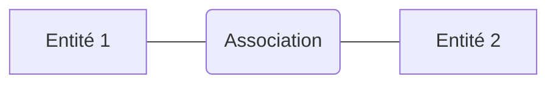

Modélisation selon une méthode descendante : on part de l'univers du discours (description en langage naturel) pour arriver, par étapes, au schéma conceptuel.

# Éléments du modèle

**Entité :** une chose concrète ou abstraite de la réalité perçue à propos de laquelle on veut conserver des informations (l'étudiant Dupont; le cours de S.E., ...). Chaque entité possède des propriétés appelées attributs.

**Attributs :** une caractéristique d'une entité ou d'une association. Il peut prendre une ou plusieurs valeurs. Les attributs peuvent être : atomiques (nom, nationalité, ...), composés (date de naissance : <jour, mois, année>), monovalués (une seule valeur pour une entité donnée), multivalués (plusieurs valeurs : langues parlées).

Dans le processus de modélisation, on ne s'intéresse pas à chaque entité séparément mais à un type d'entité (par exemple : Étudiant).
**Type d'entité :** classe de toutes les entités de réel perçu qui sont de même nature et qui joue le même rôle. Elle est définie par :
- un nom
- une définition qui précise la signification du type d'entité dans le cadre de la [[Bases de données|BdD]]
- une liste d'attributs
#Simplification on appellera entité un type d'entité et instance d'entité un objet de ce type.

**Schéma (ou intention) d'une entité :** description de l'entité (liste d'attributs). L'ensemble des occurrences d'une entité à un moment donné : l’extension ou la population de l'entité.

**Domaine (ou type de valeur) d'un attribut :** l'ensemble des valeurs autorisées (exemple : n°_de_journal = entier compris entre 1 et 366; couleur = {rouge, bleu, jaune, vert}; nom = chaîne d'au plus 15 caractères alphabétiques).

**Identifiant (ou clé):** groupe minimal d'attributs permettant d'identifier de façon unique une occurrence d'entité. Deux situations sont possibles :
- l'identifiant est formé d'un ou plusieurs attributs de l'entité (exemple : nom_éditeur est clé de l'entité éditeur; nom + prénom pour auteur; ...)
- sinon on ajoute un attribut artificiel (surrogate) qui garantit l'unicité

**Représentation graphique**

```plantuml
entity Auteur{
<u>nom</u>
<u>prénom</u>
adresse
date_nais
langues*
}
```
(<u>clé</u>, multivalué*)

**Association :** une correspondance entre deux ou plusieurs occurrences d'entité à propos de laquelle on veut conserver des informations.
#Remarque chaque occurrence d'entité joue un rôle particulier dans l'association. Les occurrences d'entité mises en correspondance participent à l'association.

**Un type d'association :** la classe de toutes les associations possibles du réel qui vérifient la définition constitutive du type (un nom, une liste d'entités non nécessairement distinctes avec leurs rôles respectifs et une description qui précise la signification du type d'association).
#Notation $A(ro_1 \ : \ E_1, \ ..., \ ro_n \ : \ E_n)$ ou notation simplifiée : $A(E_1, \ ..., \ E_n)$ 
#Exemple écriture(écrit : auteur, est_écrit_par : article)
#Simplification on appellera association une type d'association, on appelle occurrence d'association ce qu'on appelait une association.

**Extension de l'association :** l'ensemble des occurrences qui existent à un moment donné pour cette association.

**Degré (ou arité ou dimension) d'une association :** le nombre d'entité qui y participent.
#Exemple cours(classe, professeur, salle) : degré = 3.

**Collection d'une association :** l'ensemble des entités qui apparaissent dans son schéma (sans doubles).

**Représentation graphique**



Une association est cyclique (ou réflexive ou récursive) si sa collection contient au moins une entité qui participe plus d'une fois à l'association.
#Exemple paternité(père : personne, fils : personne)
Fonctionnalité d'une association binaire $A$ définie sur $E_1$ et $E_2$ :
- un à un : si à une occurrence de $E_1$ peut correspondre, via $A$, au plus une occurrence de $E_2$ et réciproquement
	#Exemple  association entre Véhicule et Carte-grise
- un à plusieurs (1 à n) : si à une occurrence de $E_1$ peuvent correspondre plusieurs occurrences de $E_2$ mais à une occurrence de $E_2$ correspond au plus une occurrence de $E_1$ 
	#Exemple Est_dans(Ville, Musée)
- plusieurs à plusieurs (n à m) : à une occurrence de $E_1$ peuvent correspondre plusieurs occurrences de $E_2$ et réciproquement
	#Exemple Possède(Personne, Véhicule
Une association peut avoir ses attributs propres
#Exemple Emprunt(Abonné, Livre, Date_emprunt)

**Identifiant d'une association :** il est implicite, il est formé par l'ensemble des identifiants des entités participantes.

**Cardinalité d'une couple entité-association $(E, \ A)$ :** un coupe d'entités $(x, \ y)$ tel que
- $x$ représente le nombre minimum d'occurrences de $A$ pouvant exister pour une occurrence donnée $E$
- $y$ représente le nombre maximum
#Exemple On a la contrainte que tout auteur doit avoir écrit au moins un article $\rightarrow$ $x = 1$ et $y=n$. Tout article doit être écrit par un seul auteur $\rightarrow$ $x=1$ et $y=1$.
Bibliothèque : Livre_Emprunt : card = (0, 1); Lecteur_Emprunt : card = (0, n).

**Représentation graphique**

#Schéma

**Entité faible :** une entité sans identifiant propre. Son identifiant est construit en combinant des attributs propres à l'entité et des attributs provenant d'une entité qui participent à la même association que E. 
#Exemple Chien $\rightarrow$ id = (nom_chien, nom_prop).

#Schéma

#Exemple des journaux :
- un éditeur édite un ou plusieurs journaux, chaque journal est édité par un éditeur
- chaque journal sort un ou plusieurs numéros. Chaque numéro est sorti par un journal
- un numéro regroupe plusieurs articles (éventuellement 0). Un article parait au moins une fois
- un article est écrit par un seul auteur. Un auteur écrit un ou plusieurs articles

#Schéma 

# Contraintes d'intégrité (CI)

#But spécifier des propriétés sémantiques du réel perçu

#Définition une CI est une propriété que doivent satisfaire les données de la base. Une CI peut être :
- statique : doit être vérifié à tout moment (exemple : la date de mariage doit être ultérieur à celle de naissance).
- dynamique : à vérifier lors d'un changement d'état de la [[Bases de données|BdD]] (exemple : changement d'état civil : transitions autorisées : célibataire $\rightarrow$ marié; marié $\rightarrow$ divorcé; marié $\rightarrow$ veuf; divorcé $\rightarrow$ marié; veuf $\rightarrow$ marié).

CI statiques obligatoires :
- identification : un clé pour chaque entité
- cardinalité
- attribut obligatoire ou facultatif $\rightarrow$ spécifier les attributs qui peuvent être inexistant ou inconnu pour une occurrence d'entité donnée (exemple : nom de jeune fille pour un homme)
	#Remarque tous les attributs de la clé sont obligatoires

# Contrainte de sous-typage

Concept d'héritage $\rightarrow$ permet de définit un entité spécialisée par rapport à une entité générale. Dans les entités filles, on ne fait figurer que les caractéristiques qui leur sont propres et elles héritent de toutes les caractéristiques de l'entité mère.
#Exemple Entreprise qui a des partenaires : clients et fournisseurs

#Schéma

# Mise sous forme canonique

#But Production d'un schéma le plus clair possible et éviter les anomalies de mise à jour de la [[Bases de données|BdD]].
**Points clés :** éliminer la redondance, éliminer les ambiguïtés
# Contraintes d'intégrité fonctionnelles (CIF)

### Dépendances fonctionnelles entre attributs

#Exemple entité vélo (n° cadre, marque, modèle, utilisateur, couleur, dim_cadre, diam_cadre, diam_roues, nom_prop, prénom_prop, adresse_prop).

Considérons les CI suivantes : 
- à un modèle d'une marque correspond un seul diamètre de roue (a)
- à un propriétaire (nom_prop, prénom_prop) correspond une seule adresse (b)
$\rightarrow$ deux exemple de dépendances fonctionnelles.

#Définition Étant donné une entité ou une association, un attribut B dépend fonctionnellement d'une attribut A ssi chaque valeur de A correspond à au plus une valeur de B.
#Notation $A \xrightarrow{T} B$ (T: nom de l'entité ou de l'association).
#Généralisation A peut être un groupe d'attributs (B aussi)
$(A_1, \ ..., \ A_n) \xrightarrow{T} (B_1, \ ..., \ B_n)$
$(marque, \ modèle) \xrightarrow{vélo} diam\_roues$ 
$(nom\_prop, \ prénom\_prop) \xrightarrow{vélo} adresse\_prop$
#Remarque par définition, chaque attribut qui n'est pas dans la clé dépend fonctionnellement de la clé

### Dépendances fonctionnelles entre entités

#Schéma 

Considérons la dépendance fonctionnelle : $musicien \xrightarrow{engage} instrument$ : "un musicien professionnel est spécialisé : il joue d'un seul instrument"

#### Dépendances multivaluées : dépendance d'un attribut (ou d'un groupe) monovalué vers un attribut multivalué

$A \xtwoheadrightarrow{T} B$ : la connaissance d'une valeur de $A$ détermine un ensemble de valeur de $B$.
#Exemple entité $étudiant(\underline{num\_etd}, nom, prénom, nom_cursus, cours*)$
Si un cursus détermine les cours à suivre, on a : $nom\_cursus \xrightarrow{étudiant}cours$ 

**<u>Règle n° 1 :</u> Unicité des noms et absence d'homonymes**
$\rightarrow$ Chaque objet du schéma (entité, association, attribut, CI, ...) reçoit un nom unique.

**<u>Règle n° 2 :</u> Absence de synonymes** 
deux objets sémantiquement équivalents se retrouvent dans le schéma sous des noms différents
$\rightarrow$ Éliminer l'un des deux objets et restructurer le schéma.

**<u>Règle n° 3 :</u> Tout identifiant doit être minimal**
(cas des identifiants constitués d'un groupe d'attributs)
$\rightarrow$ vérifier qu'il n'existe pas un sous-groupe qui soit lui-même une clé.
**Vérification :** il n'existe pas de dépendance fonctionnelle (DF) entre un sous-groupe de la clé et un attribut de la clé.
#Exemple clé = $ABCD;$ DF : $AB\rightarrow C$; clé = $ABD$
#Exemple entité $éditeur(\underline{nom\_éditeur}, \underline{adresse\_éditeur})$ 
Supposons qu'il existe une DF $nom\_attribut \rightarrow adresse\_éditeur$ donc $nom\_éditeur$ est à lui seul identifiant. 

**<u>Règle n° 4 :</u> Mise en évidence des attributs dérivables**
Un attribut est dit dérivable si sa valeur peut être calculée à partir de la valeur d'autres attributs.
#Exemple somme, moyenne, écart-type $\rightarrow$ donner sous forme de CI la règle de calcul

**<u>Règle n° 5 :</u> Élimination de structures redondantes**
premier cas : attribut redondant avec une association
#Exemple #Schéma 
deuxième cas : association redondante avec d'autres associations
#Exemple #Schéma 
#Contre-exemple #Schéma 
Pas de redondance !
Il faut faire attention à la signification de ces associations!

**<u>Règle n° 6 :</u> Désagrégation d'une entité**
Une entité est désagrégeable quand au moins une de ses attributs exprime une notion représentable sous la forme d'une association ou d'une entité.
premier cas : attribut multivalué
#Schéma 
deuxième cas : lorsqu'il y a d'autres DF que celles ayant la clé en partie gauche
#Schéma 
Supposons qu'il existe la DF $code\_postal \rightarrow localité$ 
troisième cas : lorsqu'il y a des attributs prenant la valeur "inexistant" en fonction de la valeur d'autres attributs
#Schéma 

**<u>Règle n° 7 :</u> Désagrégation d'une association**
Similaire au cas de l'entité mais le processus est un peu plus complexe

**<u>Règle n° 8 :</u> Décomposition d'une association**
Lié à la présence de DF entre entités
#But remplacer une association de degré $n\geq 3$ par plusieurs associations dont le degré sera $\leq n-1$ 
premier cas  : il existe au moins une DF entre entités mais il n'existe pas d'entité avec une connectivité $(0,1)$ ou $(1,1)$ 
#Schéma 
- Soit $A(E_1, \ ..., \ E_n)$ une association 
- $\nexists i \ tq \ max_i = 1$
- $\exists i \ tq \ E_i \xrightarrow{A} E_j$ 
Alors la décomposition se fait comme suit :
- $A_1(E_i, E_j)$ d'ordre 2
- $A_2(\bigcup\limits_{k\neq j}E_k)$ d'ordre $n-1$
#Remarque s'il existe plusieurs DF entre entités, on itère le processus
deuxième cas : il existe une entité dont la cardinalité est $(0,1)$ ou $(1,1)$
Soit $A(E_1, \ ..., \ E_n)$ tel que $card(E_i)=(0,1)$ ou $(1,1)$
S'il existe $(n-1)$ DF : $E_i \xrightarrow{k} E_s \ (i\neq s)$, alors on peut remplacer l'association A par $(n-1)$ association binaires $A_s(E_i, E_s)_{s\neq i}$ 
#Schéma 