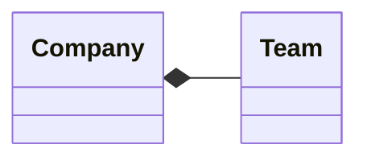

[[Agrégation]] forte.
La destruction de l'[[Objet]] composite entraîne la destruction de tous les [[Objet|objets]] composants.

Ex : hôtel et chambre -> si on détruit l'hôtel on détruit forcement toutes les chambres.

