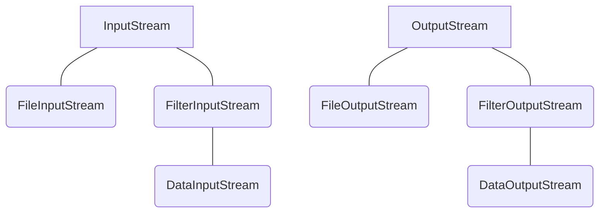

En [[Java]] les flux sont unidirectionnels.

[[Java]].io possède 3 fonctionnalités :
- Manipulation de fichier : grâce à la [[Classe]] File (représentation abstraite des fichiers physiques)
- Flux binaires : manipulation des flux entrant et sortant à l'aide des [[Classe abstraite|classes abstraites]] InputStream et OutputStream

- [[Serialization vs Deserialization|Sérialisation|Sérialisation]] : écrire un objet ainsi que tous les objets qu'il référence dans un flux binaire (le procédé inverse est la [[Serialization vs Deserialization|désérialisation]]) $\to$ implémentation de l'[[Interface]] Serializable ([[Serialization vs Deserialization|sérialisation]] à l'aide de ObjectOutputStream et [[Serialization vs Deserialization|désérialisation]] à l'aide de ObjectInputStream).