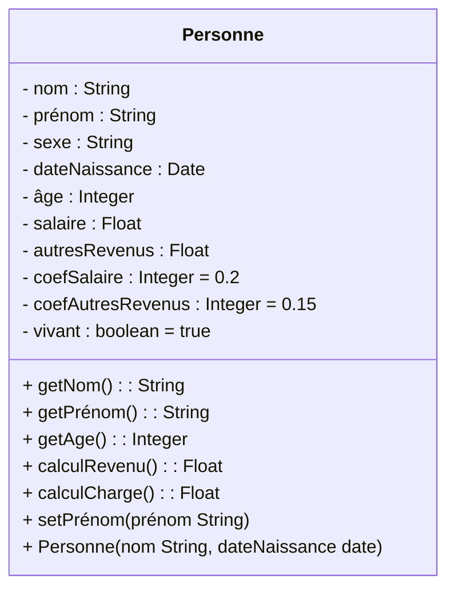
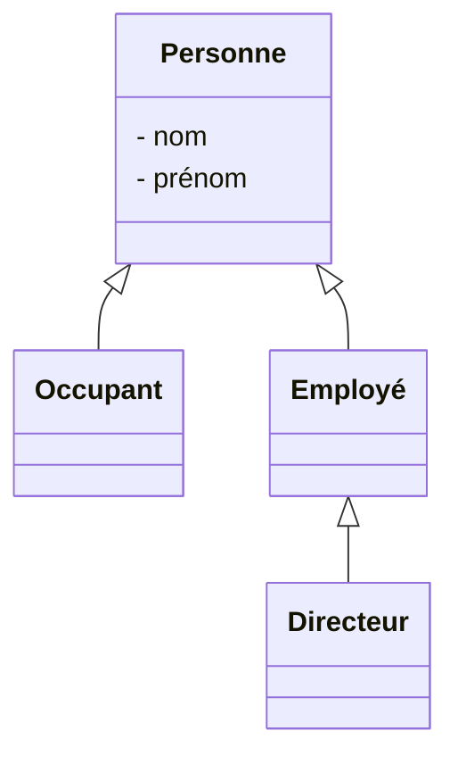

En [[Java]] toutes les [[Classe|classes]] [[Héritage|héritent]] implicitement de la [[Classe]] Object. 

Concept abstrait, modèle à partir duquel des objets peuvent être créés.
ex: personne, animal, polygone, etc...

Elle est constituée d'attributs de classe (communs à tous les éléments de même classe) et d'instance (propres à cette instance) et de [[Méthode|méthodes]].

En général les attributs sont privés et les comportements publics. Gestion de la visibilité $\to$ principe d'[[Encapsulation]]. 

Avantage $\to$ décentralisation (dans le programme principal on se contente de gérer les [[Objet|objets]] avec leur [[Méthode|méthodes]] que l'utilisateur n'a pas besoin de comprendre ni connaître, ce sont les [[Objet|objets]] qui prennent les décisions - fonctions de haut niveau utilisant des fonctions de bas niveau sans en être conscient et sans soucier du mode d'implémentation).

Diagramme de [[Classe]] :

Puis diagramme d'associations des différentes [[Classe||classes]].

Associations $\to$ identification ([[Agrégation]] ou [[Composition]]) et multiplicité
Dans notre exemple : un hôtel peut avoir plusieurs employés (0..\*) mais seulement un directeur (1).

Parfois, une association doit posséder des propriétés $\to$ [[Classe d'association]] 

En [[Java]], une [[Classe]] est composée :
- d'au moins un [[Constructeur]]
- d'attributs
- de [[Méthode|méthodes]]

En [[Java]] il n'y a qu'une seule [[Classe]] par fichier qui peut être publique. Le mieux est d'avoir une [[Classe]] par fichier et regrouper les fichiers par packages. Une [[Classe]] publique est accessible partout, sinon, par défaut, elle n'est accessible que par les classes du même package. On dit qu'elle est protégée. Si c'est le cas, il faut l'importer pour l'utiliser. D'où l'utilité d'organiser en packages ses projets.

[[Classe abstraite]]

[[Interface]]

[[Classe paramétrée]]

