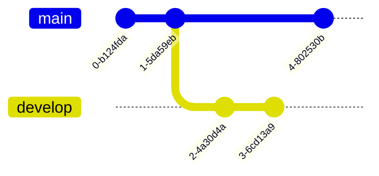
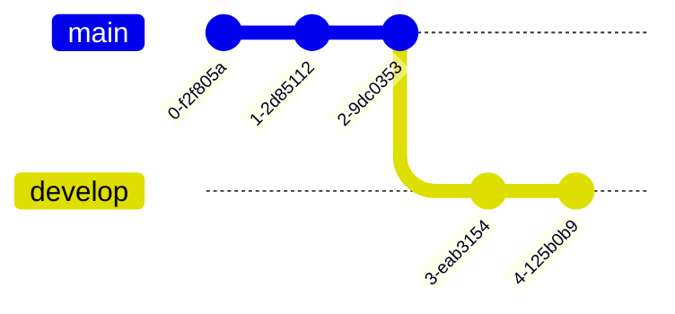

(British, slang, pejorative) A silly, incompetent, stupid, annoying or
childish person.

Système asynchrone distribué qui permet le travail collaboratif et le versioning.

![[Pasted image 20240130165223.png]]

Utiliser git-flow pour un workflow idéal. Son but est d'automatiser les appel git pour les branch et merge. C'est une sorte de [[Makefile]] pour [[Git]].

![[Pasted image 20240130174358.png]]

Pour les dépôts publiques, il faut un canal de communication ([[SSH]], [[HTTP]], [[HTTPS]], etc...)
origin/master est dans le répertoire local $\ne$ master du répertoire distant 
# Commandes

## Configuration de l'identité
```bash
git config --global user.name "votre nome"
git config --global user.email nom.pre@uni.fr
```

## Configuration de l'éditeur
```bash
git config --global core.editor micro
```

## Initialisation d'un dépôt local
```bash
git init
```

## Ajout du suivi d'un fichier
```bash
git add
```

## Supprimer le suivi d'un fichier
```bash
git rm
```

## Renommer un fichier en conservant le suivi
```bash
git mv
```

## État de l'espace de travail
```bash
git status
```

## Afficher la tête du master
On peut rajouter un id (au moins les 4 premiers char si non ambigüe) pour afficher le contenu de ce commit
```bash
git show
```
## Comparer avec l'espace de travail
On peut rajouter les identifiants des commit que l'on veut comparer
(Concaténation des git show)
```bash
git diff
```

## Enregistrer l'index
```bash
git commit -m "message"
```

## Pousser le dépôt local
```bash
git push
```

## Synchroniser le dépôt local
On peut choisir si on pull avec ou sans rebase (cf. plus bas)
Dans le domaine de l'open source, approche par merge/pull : créer un nouveau remote, faire les commit et faire une pull request.
```bash
git pull
```

## Récupérer un dépôt
```bash
git clone
```

## Voir les versions du dépôt
```bash
git log
```

## Créer une branche de test
```bash
git branch
```

## Déplacer la version de mon Workspace vers la version d'un précédent commit
Peut être utilité pour se déplacer de branche en branche
```bash
git checkout
```

## Fusionner une branche de test dans la branche principale
On peut faire l'inverse et merger le master dans une branche pour la mettre à jour (ce qui ne modifie pas le master).
```bash
git merge new-feature # merges new-feature into master
```

## Autre solution
```bash
git rebase
```

**Avant rebase**

**Après rebase** 

## Donner un alias à une version
au prochain git log, la dernière version aura comme tag : stable
```bash
git tag stable
```

## Recherche dichotomique des commit à la recherche d'un bug
```bash
git bitsect
```

## Copier-coller un commit
```bash
git chery-pick
```


