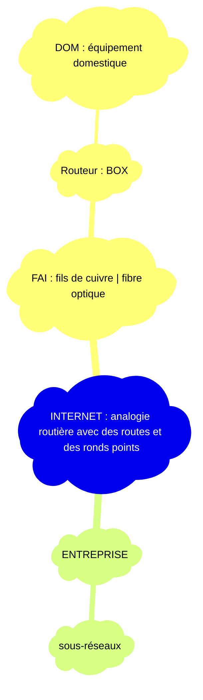

**FITL :** Fiber In The Loop
**ADSL :** Asymmetric Digital Subscriber Line

# Protocole

Protocoles : règles (langage, ordre)
- [[SNMP]]
- [[HTTP]] / [[HTTPS]]
- [[FTP]]
- [[SMTP]] / [[IMAP]]
- [[Telnet]] / [[SSH]] 
- [[DNS]]
- [[OSPF]] / [[RIP]]

