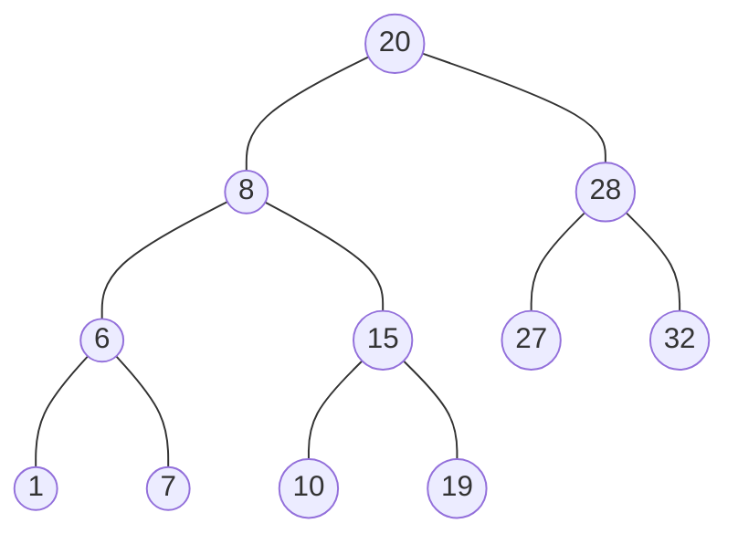
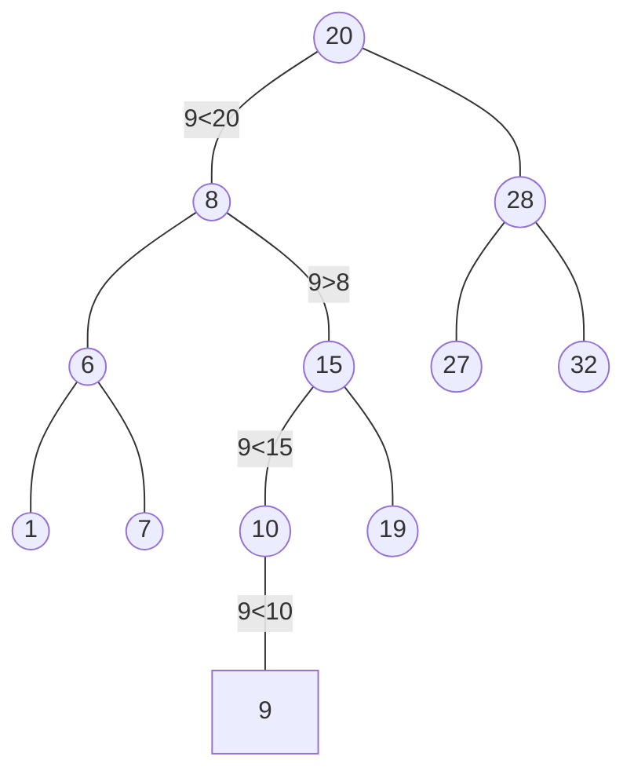

# Définition

L'arbre vide est une [[ABR]]
Soit <r, g, d> un [[ABR]] :
g et d sont aussi des [[ABR]] et
$\forall x \in val(g), x \lt r$ 
$\forall x \in val(d), x \gt r$ 

Implémentation en [[C]]
```C
struct noeud_s{
	int val;
	struct noeud_s* g;
	struct noeud_s* d;
}

typedef struct noeud_s noeud;

typedef noeud* abr;
```



**Opération de recherche d'un entier x dans A un [[ABR]].**
Adoptons une approche récursive, on distingue 2 cas :
- Le cas de A vide $\to$ On retourne false
- Le cas de A non vide $\to$ A = <r,g,d>:
	- si $x=r$ alors retourner True
	- sinon
		- soit $x\lt r$ $\to$ recherche dans g
		- soit $x\gt r$ $\to$ recherche dans d
Justification : Par propriété des [[ABR]], les éléments de < à (resp. > à) la racine sont forcément dans g (resp. dans d)

# Opération d'insertion en feuille d'une valeur x dans un [[ABR]]



Cette opération consiste à trouver la bonne place pour x en appliquant un procédé similaire à la recherche de l'élément.

# Opération d'ajout d'une entier x dans A un [[ABR]]

Précondition : $x \notin val(A)$ 
Adoptons une approche récursive, on distingue 2 cas :
- Le cas de A vide
- Le cas de A non vide $\to$ A = <r,g,d>
	HR : On admet savoir insérer x dans g (resp. d) en feuille, de sorte que f (resp. d) soit un [[ABR]].

a) A est vide :
	On crée un nœud contenant x que A va désigner. A ne contient que x de sous arbres g et d vides $\to$ feuille . A est réduit à un nœud, c'est un [[ABR]].
b) A est non vide :
	- si $x\lt r$, pour préserver les propriétés d'[[ABR]], on doit insérer x dans g (OK par HR).
	- si $x\gt r$, idem par symétrie.


