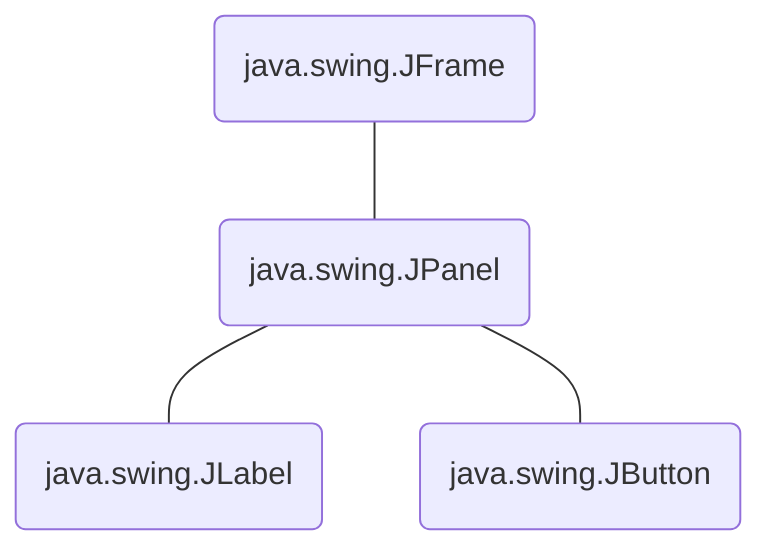

Bibliothèque [[Java]] utilisée pour créer des interfaces graphiques (interfaces homme-machine). Elle utilise elle-même une autre bibliothèque : AWT. Elle permet d'implanter des composants légers ce que permet une excellente potabilité (même si AWT reste plus rapide car natif).

```Java
public Exemple1(){
	JFrame maFrame = new JFrame();
	maFrame.setSize(500, 150);
	maFrame.setTitle("ma première fenêtre");
	maFrame.setVisible(true);
	maFrame.setDefaultCloseOperation(JFrame.EXIT_ON_CLOSE);
}
```

Conteneur principale :
- JFrame : fenêtre d'application
- JWindow : utilisé pour les Splash Screen (vide et non redimensionnable)
- JDialog : message d'erreur, d'avertissement, … 

Composants intermédiaires (composants composés de composants) :
- JToolBar
- JPanel
- etc... 

Composants atomiques :
- JButton
- JLabel
- JTextField
- JComboBox
- JTable
- etc...

Les composants sont organisés selon une structure arborescente, par exemple :

Ces derniers sont placés en suivant le gestionnaire d'agencement utilisé.
Écouter des événements se fait de la même façon qu'en [[Javascript]] à l'aide d'un ``ActionListener(écouteur)`` l'écouteur peut implémenter l'[[Interface]] ActionListener.
